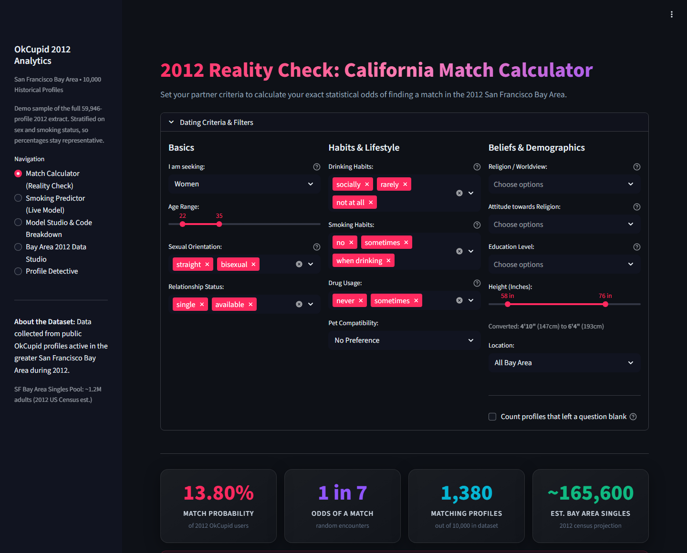
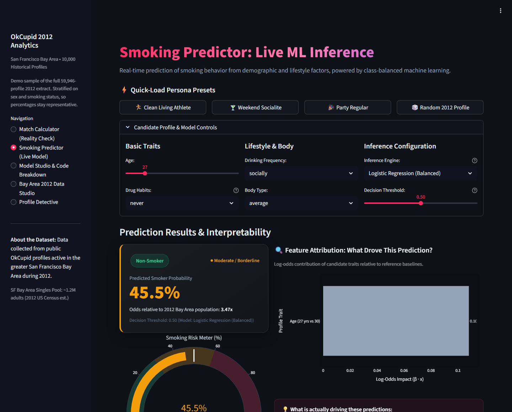
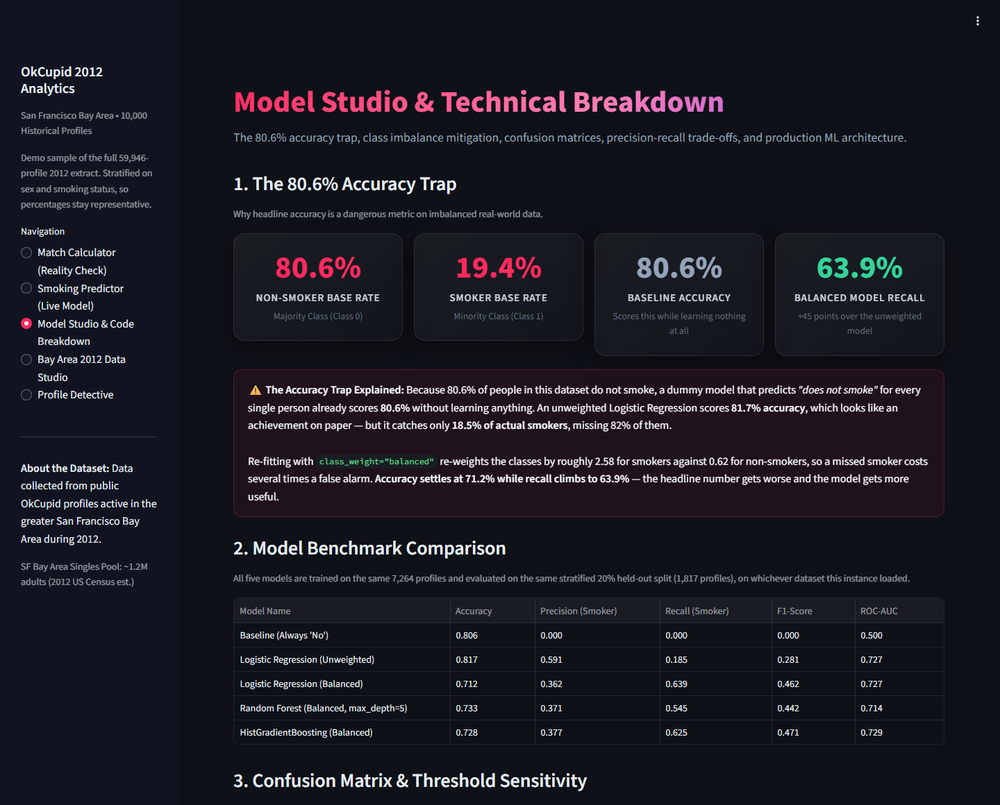
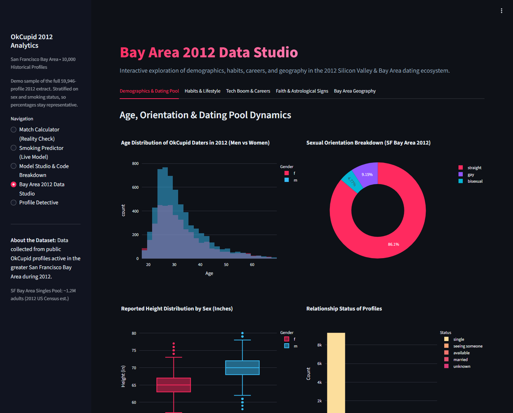
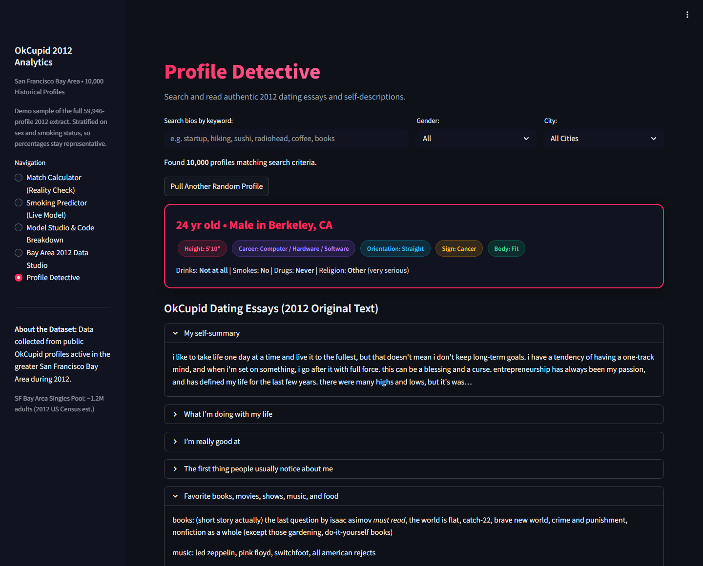

# Cupid 2012 — OkCupid Dating Data Studio

**An interactive Streamlit app for exploring 59,946 real OkCupid profiles from the
2012 San Francisco Bay Area — plus an honest machine-learning study on whether
smoking is predictable from the rest of a dating profile.**


[](https://github.com/ShadowstheDark/OK_Cupid_Smoking_predictor/actions/workflows/ci.yml)

[](https://okcupidsmokingpredictor-bb36gkdr5sbeub82b6lz83.streamlit.app/)

---

## The short version

**The app** turns a 151 MB historical dating dataset into something you can actually
poke at: set your own partner criteria and see your real odds, then find out which
single requirement is doing the most damage to your dating pool.

**The study** answers a narrower question honestly, and mostly in the negative.
Smoking *is* weakly predictable from the rest of a profile — but the headline number
that looks like success is not one, and the notebook is largely about proving that.

*Implementation was AI-assisted. What is mine, and what I caught along the way, is in
[How this was built](#how-this-was-built).*

<!-- benchmark:start -->
**Committed sample — 10,000 rows** — shipped in the repository and served by the deployed app. Stratified on sex and smoking status, so shares stay representative.

| Model | Accuracy | Precision (smoker) | Recall (smoker) | F1 (smoker) | ROC-AUC |
|---|---|---|---|---|---|
| Baseline — always answer "does not smoke" | 0.806 | 0.000 | 0.000 | 0.000 | 0.500 |
| Logistic regression | 0.817 | 0.591 | 0.185 | 0.281 | 0.727 |
| Logistic regression, `class_weight="balanced"` | 0.712 | 0.362 | 0.639 | 0.462 | 0.727 |
| Random forest, `max_depth=5` | 0.733 | 0.371 | 0.545 | 0.442 | 0.714 |
| HistGradientBoosting (balanced) | 0.728 | 0.377 | 0.625 | 0.471 | 0.729 |

- Profiles in file: **10,000**
- Profiles with a usable smoking label: **9,081**
- Held-out test split (20%, stratified): **1,817**
- Smoker base rate: **19.4%**
- Smoker rate when the drugs question was answered `never`: **12.4%** (7,214 profiles)
- Smoker rate when the drugs question was left blank: **23.1%** (1,867 profiles)

_Generated by `python scripts/report_metrics.py --write`; do not edit by hand._
<!-- benchmark:end -->

### What that table actually says

**80.6% of the people who answered the smoking question do not smoke.** So the plain
logistic regression's 81.7% accuracy is not a result — it is the base rate plus a
rounding error, and that model catches under a fifth of actual smokers. The extra
accuracy came from learning to say "no" more confidently, not from learning anything.

Balancing the class weights fixes the right thing and wrecks the headline number:
accuracy falls by ten points while recall on smokers more than triples. If the goal is
*finding* smokers rather than *scoring* well, that trade is worth making — and it is
completely invisible if you only ever report accuracy.

The signal that does exist is almost entirely drug use and drinking, while age is
close to irrelevant. That is nearly tautological: those are co-reported habits from
the same session, not independent evidence, which is the strongest reason to be
sceptical of the model even though its numbers look respectable.

The most useful thing the study does is refuse to overclaim. Five-fold
cross-validation shows the random forest's depths 3, 5 and 7 landing inside one
fold-to-fold standard deviation of each other — so "depth 7 is best" is reading
noise. An earlier version of this analysis did exactly that; the notebook shows the
corrected version with the numbers attached.

### Two artefacts, two runs — read the labels

The table above is regenerated from the shipped pipeline on the **committed
10,000-row sample**, which is exactly what the deployed app serves, so the README and
the app now agree. The [notebook](notebooks/okcupid-smoking-prediction.ipynb) reports
the **full 59,946-row extract** instead, and it encodes one-hot features differently:
with `get_dummies(drop_first=True)` on raw columns, an unanswered question produces an
all-zero row that the model cannot distinguish from the reference answer. That is why
its balanced model lands at 0.709 accuracy / 0.592 recall while the shipped pipeline
reaches 0.716 / 0.625 on the same rows and the same split. Every number in both
artefacts, with the dataset named next to it, is in **[RESULTS.md](RESULTS.md)**.

→ **[Read the full analysis](notebooks/okcupid-smoking-prediction.ipynb)**
→ **[Model results, both datasets](RESULTS.md)**

---

## Screenshots

### Match Calculator — set your criteria, see the odds



Twelve filters, a live probability card, and a **dealbreaker funnel** that shows how
many candidates each requirement removes. The panel on the right names the single
biggest bottleneck — in the default configuration, filtering by gender alone
eliminates 59.8% of the pool before anything else gets a say. Every filter treats an
unanswered question the same way, and the funnel reports how much of each step's
attrition came from blank answers rather than genuine mismatches.

### Smoking Predictor — live inference with the reasoning shown



Pick a persona or set your own traits, choose the model and the decision threshold, and
watch the probability move. The bar chart attributes the prediction to individual
traits in log-odds, and the 🎲 preset draws a real 2012 profile so you can see whether
the model got that particular person right — mismatches included.

### Model Studio — the accuracy trap, shown rather than asserted



Every figure on this page is read off the models that were just trained on the data
this instance loaded: the base rate, all five benchmark rows, an interactive confusion
matrix, the precision/recall/F1 trade-off across thresholds, and both the logistic
odds ratios and the random forest's Gini importances. Nothing here is typed in by hand.

### Bay Area 2012 Data Studio — five tabs of exploration



Age, orientation, height and relationship status; drinking, smoking and drug habits
by age cohort; occupations and self-reported income from the 2012 Silicon Valley
boom; religion, how seriously people take it, and the zodiac; and the geography of
the Bay Area dating pool.

### Profile Detective — read the actual profiles



Full-text search across the ten OkCupid essay prompts, then a random matching
profile rendered with everything the dataset records about them. This is the part
that makes the dataset feel like people rather than rows.

---

## Quickstart

**[Try the live demo](https://okcupidsmokingpredictor-bb36gkdr5sbeub82b6lz83.streamlit.app/)** — no install needed.

Or run it locally:

```bash
git clone https://github.com/ShadowstheDark/OK_Cupid_Smoking_predictor.git
cd OK_Cupid_Smoking_predictor
pip install -r requirements.txt
streamlit run app.py
```

Then open <http://localhost:8501>. On Windows you can also double-click `run_app.bat`.

The repository ships a **10,000-row stratified sample** (`data/sample_profiles.csv`,
~16 MB) so this works immediately. Drop the full 59,946-row `profiles.csv` into
`data/full/` whenever you want the complete dataset — the app detects it and switches
automatically. See **[DATA.md](DATA.md)** for provenance and instructions.

Deep links open the app on a specific mode:

| URL | Opens |
|---|---|
| `/?page=calculator` | Match Calculator (Reality Check) |
| `/?page=predictor` | Smoking Predictor (Live ML Inference) |
| `/?page=model_studio` | Model Studio & Technical Breakdown |
| `/?page=studio` | Bay Area 2012 Data Studio |
| `/?page=detective` | Profile Detective |

One caveat about the odds figures: the calculator counts *profiles*, not people, in a
2012 self-reported dataset. The population estimate multiplies your match rate by an
independent census figure, so treat it as an order of magnitude rather than a forecast.
`DATA.md` covers what the data does and does not represent.

---

## Pipeline architecture

`smoking_model.py` holds the machine learning and imports nothing from Streamlit, so the whole pipeline can be trained, tested and scripted from a terminal. The app is a client of it, not part of it:

```
                      ┌─────────────────────────────┐
                      │    OkCupid 2012 Dataset     │
                      │ (profiles.csv / sample.csv) │
                      └──────────────┬──────────────┘
                                     │
                        data_loader.load_data()
                                     │
                                     ▼
                      ┌─────────────────────────────┐
                      │    smoking_model.py         │
                      │  • "unspecified" bug fix    │
                      │  • One-hot schema lock      │
                      │  • Stratified 80/20 split   │
                      └──────────────┬──────────────┘
                                     │
        ┌────────────────────────────┼────────────────────────────┐
        ▼                            ▼                            ▼
┌──────────────────┐       ┌──────────────────┐        ┌───────────────────────┐
│ Logistic Regress.│       │  Random Forest   │        │ HistGradientBoosting  │
│    (Balanced)    │       │   (max_depth=5)  │        │   (LightGBM-style)    │
│  Log-odds & ORs  │       │ Gini Importances │        │  best F1 of the five  │
└────────┬─────────┘       └─────────┬────────┘        └───────────┬───────────┘
         │                           │                             │
         └───────────────────────────┼─────────────────────────────┘
                                     ▼
                   ┌───────────────────────────────────┐
                   │       Live Inference Engine       │
                   │  • Real-time probability scoring  │
                   │  • Risk tiering (Low to High)     │
                   │  • Threshold sensitivity analysis │
                   │  • Log-odds feature attributions  │
                   └─────────────────┬─────────────────┘
                                     │
                                     ▼
                   ┌───────────────────────────────────┐
                   │           app.py (UI)             │
                   │  Mode 2: Live Smoking Predictor   │
                   │  Mode 3: Model Studio & Breakdown │
                   └───────────────────────────────────┘
```

---

## Test suite and continuous integration

25 tests live in `tests/` and run on every push via **GitHub Actions**
(`.github/workflows/ci.yml`) on Python 3.11 and 3.12:

```bash
pytest tests/ -v      # 25 passed
```

- `tests/test_data_loader.py`: HTML/entity stripping, pet, religion, city and education
  parsing, and dataset integrity.
- `tests/test_smoking_model.py`: feature-schema enforcement, base-rate and accuracy-trap
  behaviour, the explicit `unspecified` column, and boundary conditions in live inference.

Two notes on running them. The tests import `data_loader` and `smoking_model` from the
repository root, which is what the root `conftest.py` is for — without it the `pytest`
console script fails during collection with `ModuleNotFoundError`. (`python -m pytest`
hides that, because it puts the working directory on `sys.path` itself.) And the suite
trains five models, so it needs about 15 seconds and a readable dataset; on a clone
without `data/full/` it runs against the committed sample.

---

## Design decisions

- **Live inference, not a static notebook.** `smoking_model.py` exposes
  `predict_single_profile()`, so the app can score a persona in real time and show which
  traits moved the prediction. `@st.cache_resource` keeps the five trained models in
  memory instead of refitting on each interaction.
- **Treating "did not answer" as its own category.** Profiles that left the drugs
  question blank smoke at roughly twice the rate of those who answered `never` — a real
  signal that the notebook's encoding erased, as the [RESULTS.md](RESULTS.md) ablation
  measures. The shipped encoder gives blank answers an explicit `unspecified` column.
- **A second model family.** `HistGradientBoostingClassifier` is included alongside the
  linear and bagged models; it is the strongest of the five on F1, which is worth having
  as a check that the linear model is not simply the best available.
- **Thresholds as a dial, not a constant.** The default 0.50 cutoff is arbitrary, so the
  app exposes it and plots the precision/recall/F1 trade-off across its whole range.

---

## Reproducing the numbers

```bash
python scripts/report_metrics.py            # train and print every dataset present
python scripts/report_metrics.py --write    # regenerate the table above and RESULTS.md
pytest tests/ -v                            # 25 tests
```

`scripts/report_metrics.py` trains the real pipeline and writes its output into the
marked block above, so the figures in this README and in the app cannot drift away from
the code that produces them. The full-extract rows only appear on a machine that has
`data/full/profiles.csv`; a fresh clone reports the sample.

---

## How this was built

The implementation is AI-assisted: I used Google Antigravity and Codebuff/Claude agents
to write much of the code, and Gemini as a second opinion on the write-ups. Saying so
costs nothing and saves anyone reading this from guessing.

What I decided and can defend line by line:

- **The work itself.** The dealbreaker funnel, the live predictor, the five-mode split,
  and the choice to publish the negative result rather than a flattering one.
- **The discrepancy.** The app and the notebook were reporting different numbers for
  what was supposed to be the same experiment. Chasing it found the cause: with
  `drop_first=True`, 46,729 of 54,434 rows encode identically for "reports never using
  drugs" and "did not answer the question" — 86% of the data the model could not
  separate. The ablation in [RESULTS.md](RESULTS.md) measures what fixing that is worth.
- **Three corrections to the first version of the analysis.** A misreported accuracy
  (0.68 stated against 0.709 measured), smoker and non-smoker recall swapped in the
  prose, and "depth 7 is best" reading noise inside one cross-validation standard
  deviation.
- **The test suite's real failure mode.** The root `conftest.py` exists because the
  suite could not import its own modules under the `pytest` console script that CI
  uses; it passed locally only because `python -m pytest` puts the working directory on
  `sys.path` itself.
- **The numbers are reproducible.** `scripts/report_metrics.py` trains the pipeline and
  writes its output into this file, so every figure can be regenerated rather than
  believed.

The honest summary: the AI wrote a lot of this code, and it also produced
plausible-looking numbers that were wrong — twice. The corrected notebook and the
ablation table are the record of finding that out, which is the part I would actually
want to be asked about.

---

## What I'd do next

- **NLP on Essay Texts**: Extract TF-IDF n-grams or embeddings from the 10 essay prompts to test whether vocabulary correlates with smoking habits beyond demographic labels.
- **Fairness & Subgroup Audits**: Measure whether balanced classification error rates vary across gender, age cohorts, or orientation.
- **Model Monitoring & Drift Detection**: Add latency and distribution drift tracking for simulated production traffic.

---

## Data and ethics

The dataset is Codecademy's OkCupid extract: public profiles from the 2012 Bay Area,
including the free-text essays real people wrote about themselves. It is not mine,
and it is not covered by the MIT licence on this code.

Because that writing is personal, this repository ships a **truncated 10,000-row
sample** and points to the source rather than rehosting the full corpus. Full
provenance, schema and rebuild instructions are in **[DATA.md](DATA.md)**.

## Licence

MIT for the code — see [LICENSE](LICENSE). The dataset is excluded from that licence.

